# Darey.io - Pre-requisites, Installation Guide for Instructors and Students 

**Introduction**

This comprehensive installation guide is meticulously crafted to equip students enrolled in a suite of DevOps courses with all the necessary tools and resources. The guide provides detailed instructions for installing essential software such as Git, Visual Studio Code (VScode), virtual box, etc, alongside necessary accounts creation like AWS and GitHub. Each section is carefully linked to official sources for downloads and account setups, ensuring both ease of access and security. 

## General Requirements for New Students

**Internet Connection:** Required for accessing cloud services, documentation, and online repositories. 

**Computer:** Adequate performance to run virtual machines and containers (minimum 8GB RAM recommended). 64 bit Architecture is highly reommended

## INSTALLATIONS 

1. Visual studio code (VScode)

2. Git

3. Virtual box 

4. Ubuntu on Virtual box (Windows)

5. Ubuntu on Virtual box (intel chip macOS)


## Accounts to be created

1. Github account

2. Amazon Web Services (AWS) Account.


## INSTALLATIONS 

## Visual Studio Code (VScode)

**1. Windows Instalation:**

* **Download download vscode:** Go to [visual studo code website](https://code.visualstudio.com/)

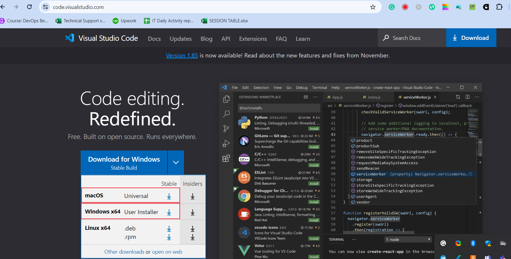

* On the web page, click "Download for Windows," if you are using windows system.

* **Run Installer:** Locate the downloaded .exe file, double-click to run the installer.


* **Wizard:** Click "Next" through the installation wizard. Click next to all the remaining prompt

* **Install:** Lastly, click install to complete the installation. When installation is complete click FINISH to complete the installation.

* **Lauching VScode:** Open from Start Menu or use the desktop shortcut or better still, just type viscode on windows app search.

If your installation is successful, it will have the following look after launching: It might be slightly different, but does not matter.

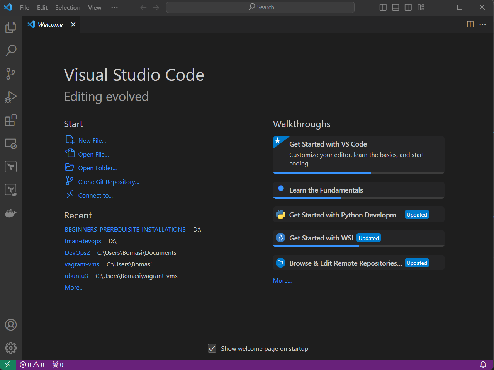


**2. macOS Instalation:**

* **Download download vscode:** Go to [visual studo code website](https://code.visualstudio.com/)

* On the web page, click "macOS" if you are using Apple laptop

* **Run Installer:** Locate the downloaded .zip file, Double-click to extract and open the VS Code application.

* **Drag to Applications:** Drag the Visual Studio Code icon to the "Applications" folder.

*  **Lauching VScode:** Navigate to the "Applications" folder, double-click on Visual Studio Code to open it.

If your installation is successful, it will have the following look after launching: It might be slightly different, but does not matter.

!


## Git

**1. Windows Instalation:**

* **Download Git:** Go to [Git website for windows](https://git-scm.com/download/win)

* On the web page, Click "Download" to download the Git installer for Windows.

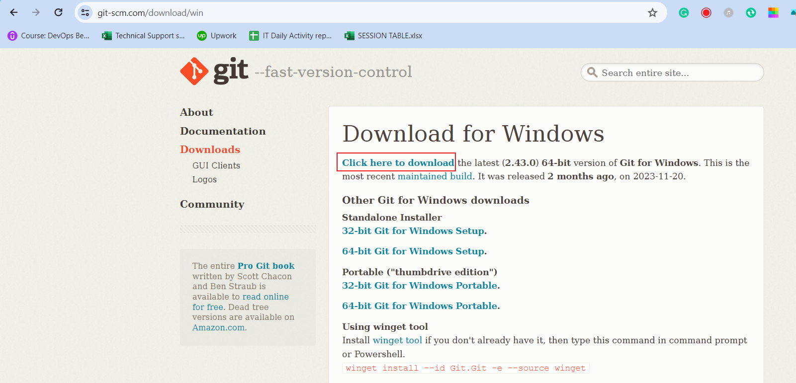

* **Run Installer:** Locate the downloaded .exe file, Double-click to run the installer.

* **Options to check if prompted:** "Use Git from the Windows Command Prompt." "Use the OpenSSL library." "Checkout as-is, commit as-is." "Use Windows' default console window."

* **Install:** Lastly, click install to complete the installation. When installation is complete click FINISH to complete the installation.

* **Launch Git:** Open from Start Menu or use the desktop shortcut or better still, just type "git" on windows app search.

If your installation is successful, it will have the following look after launching: It might be slightly different, but does not matter.

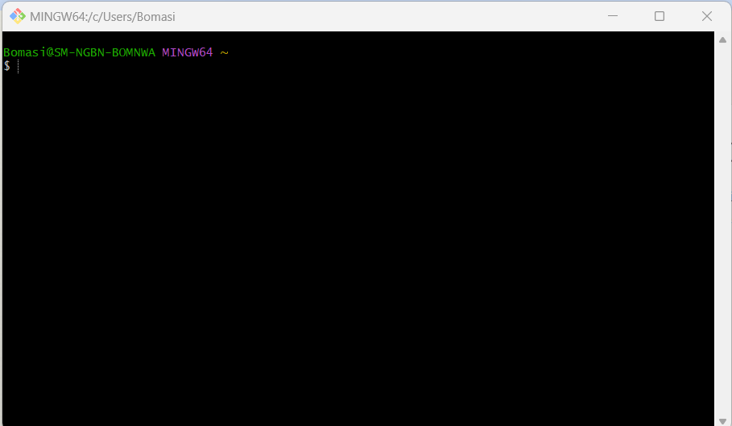


* *** **Installation with homebrew (terminal)** *****2. macOS Instalation:**


* **Install Homebrew:** Open Terminal, type the following and press "ENTER": 

    ```/bin/bash -c "$(curl -fsSL https://raw.githubusercontent.com/Homebrew/install/HEAD/install.sh)"```

**Note:** If homebrew is already installed, please ignore above step

* **Git Installation:** In your terminal type the following command and press "ENTER":

    ```brew install git```

* **Launch Git:** Open Terminal and type git --version and press Enter to verify that Git has been installed.

If your installation is successful, it will have the following look after launching: It might be slightly different, but does not matter.

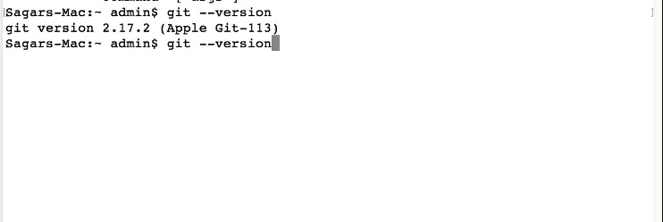


**Note:** Other methods to install Git on macOS can be found [here](https://git-scm.com/download/mac)


## Virtual Box

**1. Windows Instalation:**

* **Download Virtual box:** Go to [Oracle virtual box website](https://www.virtualbox.org/)

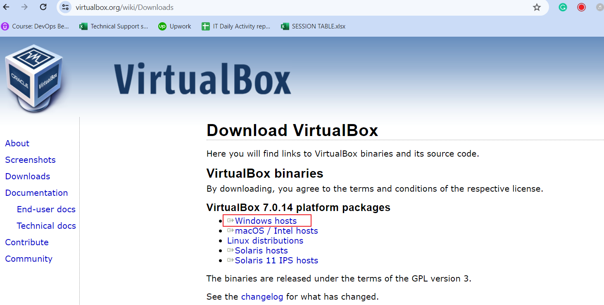

* On the web page, Click "Downloads" and select the Windows host version.

* **Run Installer:** Locate the downloaded .exe file, double-click to run the installer..

* **Wizard:** Click "Next" through the installation wizard. Click next to all the remaining prompt, leave every option to "default".

* **Install Virtual box:** Lastly, click install to complete the installation. When installation is complete click FINISH to complete the installation.

* **Lauching Virtual box:** Open from Start Menu or use the desktop shortcut or better still, just type viscode on windows app search.

If your installation is successful, it will have the following look after launching: It might be slightly different, but does not matter.

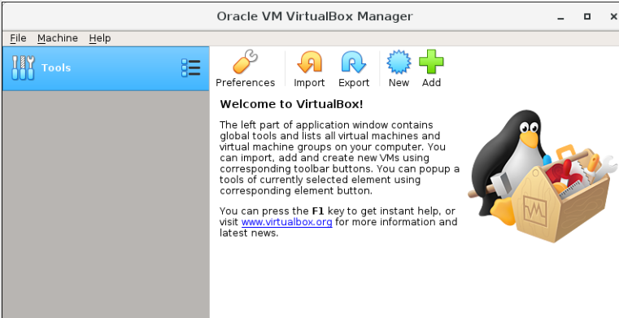

**2. macOS Instalation:** This is applicable if you are using recent macOS (Intel Proccessor chip), NOT applicable to older macOS (M1 proccessor chip)

* **Download Virtual box:** Go to [Oracle virtual box website](https://www.virtualbox.org/)

* On the web page, Click "Downloads" and select the macOS host version.

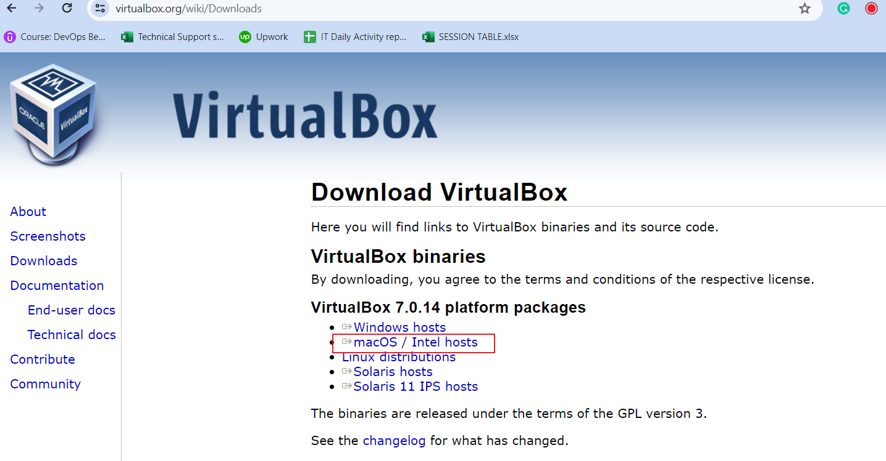

* **Run Installer:** Locate the downloaded .dmg file (usually in your Downloads folder), double-click to open the VirtualBox installer.

* **Install Virtual box:** Double-click on the package file inside the .dmg, follow the on-screen instructions to complete the installation.

* **Security warning:** If you see a security warning, click "Open" to proceed with the installation.

* **System Preferences:** Open System Preferences and go to Security & Privacy, Click the lock icon to make changes and enter your password.
Allow the Oracle Corporation system software to load.

* **Lauching Virtual box:** Open VirtualBox from the Applications folder or Launchpad.

If your installation is successful, it will have the following look after launching: It might be slightly different, but does not matter.

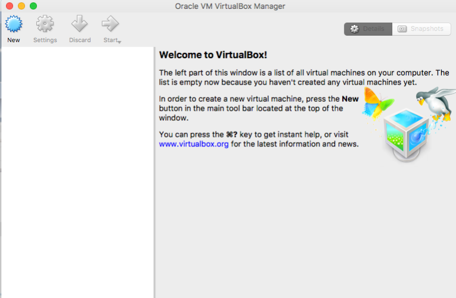


## Ubuntu (Linux Distro) on Virtual box (Windows Host)

* **Download Ubuntu Desktop ISO file:** Go to [Ubuntu official website](https://ubuntu.com/download/desktop)

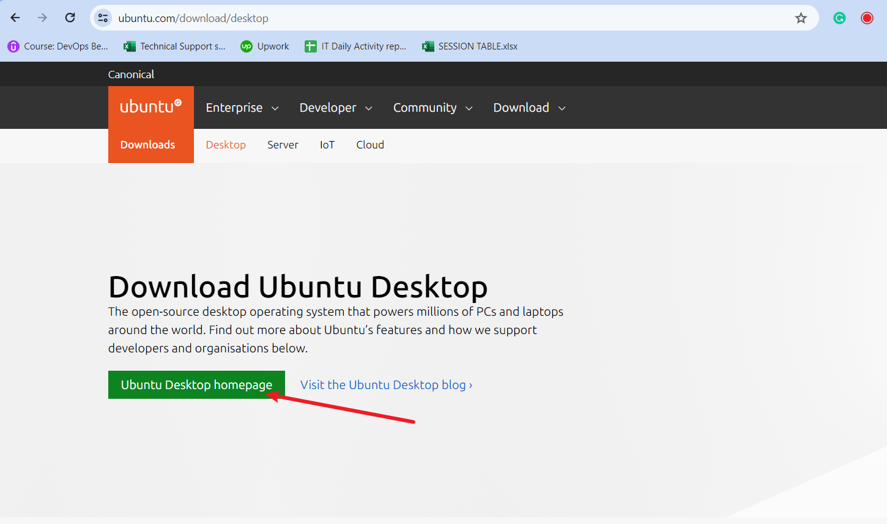

* **Virtual Box**: Launch your already installed virtual box

* **Create a New Virtual Machine:** To create a new VM, click on NEW or Plus symbol at the top center of the virtual box window.

* **Configure the virtual Machine:**  choose Linux as the type, and Ubuntu as the version. Allocate at least 2GB of RAM for the virtual machine, Create a virtual hard disk, choosing either dynamic or fixed size, "dynamic" recommended.

* **Select an installation file:** Choose the ubuntu .iso file that you downloaded from ubuntu website.

* **Start the Virtual Machine:** Launch the virtual machine and start the Ubuntu installation process.

* **Install Ubuntu:** Follow the on-screen instructions to install Ubuntu, configuring language, keyboard, user account, etc.

* **Complete Installation:** Remove the installation media when prompted, then power off the virtual machine, and ubuntu will boot to desktop as shown below, then you can enter the login credentials you created during the installation. ubuntu will boot to desktop as shown below, then you can enter the login credentials you created during the installation.

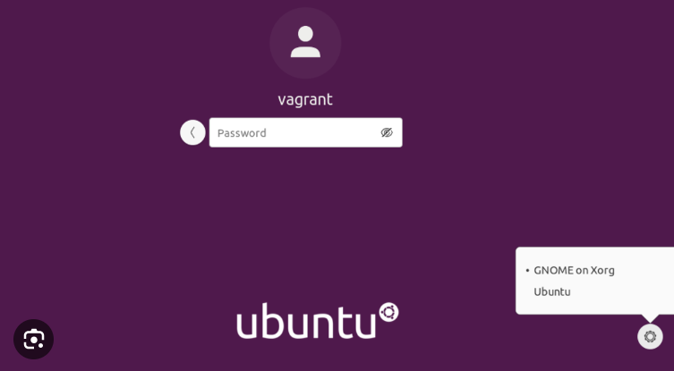

## Ubuntu (Linux Distro) on Virtual box (Mac Host)

* **Download Ubuntu Desktop ISO file:** Go to [Ubuntu official website](https://ubuntu.com/download/desktop)


* **Virtual Box**: Launch your already installed virtual box

* **Create a New Virtual Machine:** To create a new VM, click on NEW or Plus symbol at the top left hand side of the virtual box window.

* **Configure the virtual Machine:**  choose Linux as the type, and Ubuntu as the version. Allocate at least 2GB of RAM for the virtual machine.

* **Create a virtual hard disk:** Choose "Create a virtual hard disk now" and click "Create." and choose "VDI (VirtualBox Disk Image)" and click "Next." Then Choose "Dynamically allocated" and click "Next."

* **File Location and Size:** Set the location and size for the virtual hard disk, ensure sufficient space for the Ubuntu installation.

* **Mount Ubuntu ISO:** With the new virtual machine selected, click on "Settings."Go to "Storage," select the empty disk under "Controller: IDE and click the disk icon next to "Optical Drive." "Choose a disk file" and select the downloaded Ubuntu ISO.

* **Start the Virtual Machine:** Click "Start" with the virtual machine selected, follow the on-screen instructions to install Ubuntu.

* **Install Ubuntu:** Choose language and click "Install Ubuntu.", Follow the installation wizard, configuring options such as time zone, keyboard layout, and user account.

* **Complete Installation:** Once installation completes, click "Restart Now.", After reboot, you may need to press Enter to boot from the virtual hard disk. ubuntu will boot to desktop as shown below, then you can enter the login credentials you created during the installation. The interface might be slightly different from this, base on the version you downloaded


### Possible Error you may encounter and Link to resolution youtube video:

* **When virtualizaton is not enabled:** [click here](https://www.youtube.com/watch?v=MOuTxfzCvMY)

* **C++ redistributable error:** [click here](https://www.youtube.com/watch?v=xKTKgjUHu48&amp;pp=ygU6b3JhY2xlIHZtIHZpcnR1YWwgYm94IDcuMC4xMiBuZWVkcyB0aGUgbWljcm9zb2Z0IHZpcnR1YWwgYw%3D%3D)


## ACCOUNTS TO BE CREATED

Please note that account creation has nothing to do with the type of OS that you use, since you are dealing with third-party website

## Github account


* **Visit the GitHub Website:** Open your web browser and go to [GitHub's website.](https://github.com/)


* **Sign Up:** On the GitHub homepage, you will find a "Sign up" button. Click on it.

* **Enter Your Information:** Fill out the required information on the Sign up page. This typically includes your username, email address, and password. Choose a strong and secure password.

* **Verify Your Email:** After entering your information, GitHub will ask you to verify your email address. Check your email inbox for a verification message from GitHub and click on the verification link.

* **Complete the CAPTCHA:** GitHub may ask you to complete a CAPTCHA to ensure that you are not a robot. Follow the instructions to prove you're a human.

* **Choose a Plan:** GitHub offers free plans for public repositories and paid plans for private repositories. Choose the plan that best suits your needs. For beginners, the free plan is usually sufficient.


* **Tailor Your Experience (Optional):** GitHub may ask you to answer a few questions to tailor your experience. You can choose to answer them or skip this step. GitHub may ask you to answer a few questions to tailor your experience. You can choose to answer them or skip this step.


* **Welcome to GitHub:** Once you've completed the above steps, you should be redirected to your new GitHub account. Congratulations! You now have a GitHub account.

* **Explore GitHub:** Take some time to explore the GitHub platform. Familiarize yourself with the interface, and you can start by creating a new repository if you have a project in mind.

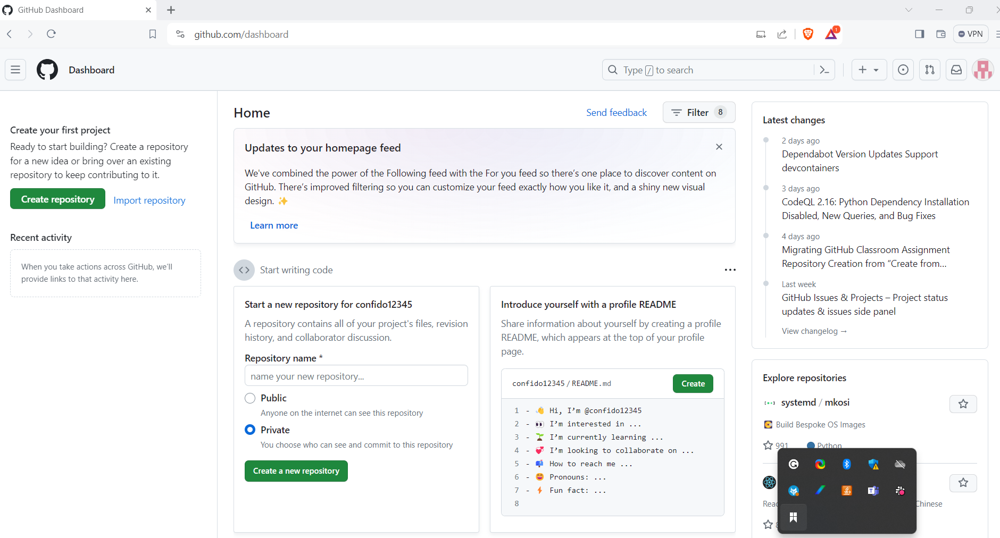


## Amazon Web Services (AWS) Account 

* **Visit the AWS Free Tier page:** Go to the AWS Free Tier page at [AWS website](https://aws.amazon.com/free/) to learn about the services available in the free tier and to start the signup process.

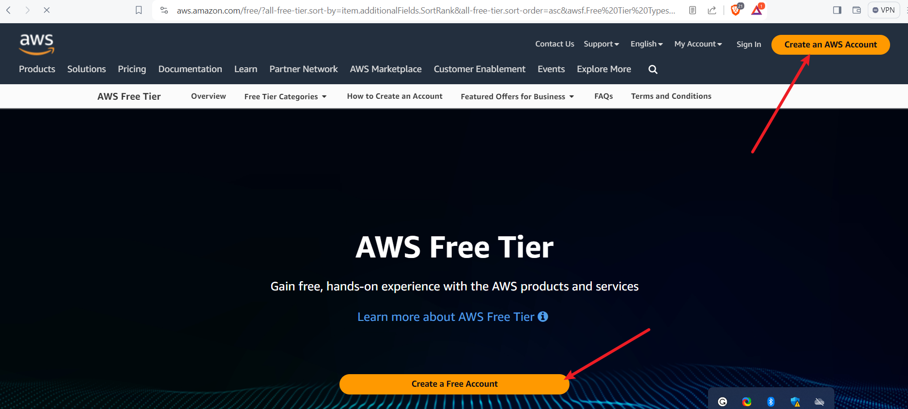

* **Click "Create an AWS Account":** On the AWS Free Tier page, click on the "Create an AWS Account" button.

Sign in or Create a new Amazon account:
If you already have an Amazon account, you can sign in. If not, you'll need to create a new one.

* **Provide account information:** Fill in the necessary account information, including your contact information and payment details. Note that you'll be required to provide valid credit card information, even though you won't be charged unless you exceed the free tier limits. You will be require to have a minimum of 1 usd in your card

**Note**: Please note that if you are from Africa country, **virtual dollar cards** will serve you better. Most regular card will not work

* **Verify your identity:** Follow the steps to verify your identity. This may involve receiving a phone call or entering a verification code sent to your email or phone.

* **Choose a support plan:** AWS offers a free support plan, but you can choose to upgrade to a paid plan if you prefer. For the free tier, the basic support plan is usually sufficient.

* **Enter payment information:** As part of the account setup, you'll need to enter valid credit card information. AWS uses this for identity verification and to prevent abuse of the free tier resources.

* **Review and confirm:** mReview the information you provided, read the terms and conditions, and confirm your agreement.

* **Wait for approval:** It might take a short while for your account to be approved. Once approved, you'll receive a confirmation email.

* **Access the AWS Management Console:** After receiving confirmation, log in to the AWS Management Console using your new account credentials.

* **Explore the AWS Free Tier services:** AWS offers a variety of services within the free tier, including EC2 (Elastic Compute Cloud), S3 (Simple Storage Service), and more. Make sure to explore and understand the limitations of each service within the free tier.

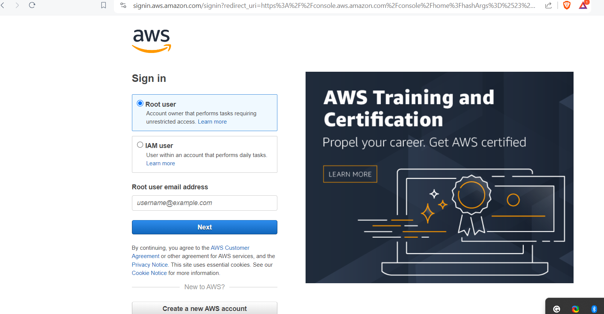


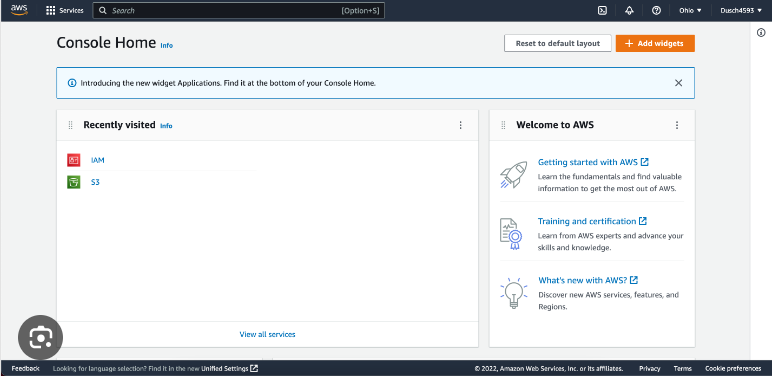


