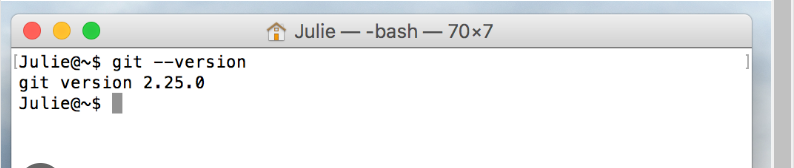

# Darey.io - Pre-requisites, Installation Guide for Instructors and Students 

**Introduction**

This comprehensive installation guide is meticulously crafted to equip students enrolled in a suite of DevOps courses with all the necessary tools and resources. The guide provides detailed instructions for installing essential software such as Git, Visual Studio Code (VScode), virtual box, etc, alongside necessary accounts creation like AWS and GitHub. Each section is carefully linked to official sources for downloads and account setups, ensuring both ease of access and security. 

## General Requirements for New Students

**Internet Connection:** Required for accessing cloud services, documentation, and online repositories. 

**Computer:** Adequate performance to run virtual machines and containers (minimum 8GB RAM recommended). 64 bit Architecture is highly reommended

## INSTALLATIONS 

1. Visual studio code (VScode)

2. Git

3. Virtual box or Vmware

4. Ubuntu on Virtual box (Windows user and intel chip macOS)

5. Installaion of Ubuntu on Vmware (M1 chip maOS)


## Accounts to be created

1. Github account

2. Amazon Web Services (AWS) Account.


## INSTALLATIONS 

## Visual Studio Code (VScode)

**1. Windows Instalation:**

* **Download download vscode:** Go to [visual studo code website](https://code.visualstudio.com/)


* On the web page, click "Download for Windows," if you are using windows system.

* **Run Installer:** Locate the downloaded .exe file, double-click to run the installer.


* **Wizard:** Click "Next" through the installation wizard. Click next to all the remaining prompt

* **Install:** Lastly, click install to complete the installation. When installation is complete click FINISH to complete the installation.

* **Lauching VScode:** Open from Start Menu or use the desktop shortcut or better still, just type viscode on windows app search.

If your installation is successful, it will have the following look after launching: It might be slightly different, but does not matter.


**2. macOS Instalation:**

* **Download download vscode:** Go to [visual studo code website](https://code.visualstudio.com/)

* On the web page, click "macOS" if you are using Apple laptop

* **Run Installer:** Locate the downloaded .zip file, Double-click to extract and open the VS Code application.

* **Drag to Applications:** Drag the Visual Studio Code icon to the "Applications" folder.

*  **Lauching VScode:** Navigate to the "Applications" folder, double-click on Visual Studio Code to open it.

If your installation is successful, it will have the following look after launching: It might be slightly different, but does not matter.

!


## Git

**1. Windows Instalation:**

* **Download Git:** Go to [Git website for windows](https://git-scm.com/download/win)

* On the web page, Click "Download" to download the Git installer for Windows.


* **Run Installer:** Locate the downloaded .exe file, Double-click to run the installer.

* **Options to check if prompted:** "Use Git from the Windows Command Prompt." "Use the OpenSSL library." "Checkout as-is, commit as-is." "Use Windows' default console window."

* **Install:** Lastly, click install to complete the installation. When installation is complete click FINISH to complete the installation.

* **Launch Git:** Open from Start Menu or use the desktop shortcut or better still, just type "git" on windows app search.

If your installation is successful, it will have the following look after launching: It might be slightly different, but does not matter.


* *** **Installation with homebrew (terminal)** *****2. macOS Instalation:**


* **Install Homebrew:** Open Terminal, type the following and press "ENTER": 

    ```/bin/bash -c "$(curl -fsSL https://raw.githubusercontent.com/Homebrew/install/HEAD/install.sh)"```

**Note:** If homebrew is already installed, please ignore above step

* **Git Installation:** In your terminal type the following command and press "ENTER":

    ```brew install git```

* **Launch Git:** Open Terminal and type git --version and press Enter to verify that Git has been installed.

If your installation is successful, it will have the following look after launching: It might be slightly different, but does not matter.




**Note:** Other methods to install Git on macOS can be found [here](https://git-scm.com/download/mac)


## Virtual Box

**1. Windows Instalation:**

* **Download Virtual box:** Go to [Oracle virtual box website](https://www.virtualbox.org/)


* On the web page, Click "Downloads" and select the Windows host version.

* **Run Installer:** Locate the downloaded .exe file, double-click to run the installer..

* **Wizard:** Click "Next" through the installation wizard. Click next to all the remaining prompt, leave every option to "default".

* **Install Virtual box:** Lastly, click install to complete the installation. When installation is complete click FINISH to complete the installation.

* **Lauching Virtual box:** Open from Start Menu or use the desktop shortcut or better still, just type viscode on windows app search.

If your installation is successful, it will have the following look after launching: It might be slightly different, but does not matter.


**2. macOS Instalation:**

* **Download Virtual box:** Go to [Oracle virtual box website](https://www.virtualbox.org/)

* On the web page, Click "Downloads" and select the macOS host version.


* **Run Installer:** Locate the downloaded .dmg file (usually in your Downloads folder), double-click to open the VirtualBox installer.

* **Install Virtual box:** Double-click on the package file inside the .dmg, follow the on-screen instructions to complete the installation.

* **Security warning:** If you see a security warning, click "Open" to proceed with the installation.

* **System Preferences:** Open System Preferences and go to Security & Privacy, Click the lock icon to make changes and enter your password.
Allow the Oracle Corporation system software to load.

* **Lauching Virtual box:** Open VirtualBox from the Applications folder or Launchpad.

If your installation is successful, it will have the following look after launching: It might be slightly different, but does not matter.


Download:

Visit https://www.virtualbox.org/.
Click "Downloads" and select the macOS host version.
Run Installer:

Locate the downloaded .dmg file (usually in your Downloads folder).
Double-click to open the VirtualBox installer.
Install VirtualBox:

Double-click on the package file inside the .dmg.
Follow the on-screen instructions to complete the installation.
Security Warning (if prompted):

If you see a security warning, click "Open" to proceed with the installation.
Finish Installation:

Wait for the installation to complete.
Close the installer.
System Preferences:

Open System Preferences and go to Security & Privacy.
Click the lock icon to make changes and enter your password.
Allow the Oracle Corporation system software to load.
Run VirtualBox:

Open VirtualBox from the Applications folder or Launchpad.


Download:

Go to https://www.virtualbox.org/.
Click "Downloads" and select the Windows host version.
Run Installer:

Locate the downloaded .exe file.
Double-click to run the installer.
Wizard:

Click "Next" through the installation wizard.
Components:

Choose components to install (default settings are usually fine).
Location:

Select the installation location or use the default. Click "Next."
Shortcuts:

Choose Start Menu shortcuts and desktop icons. Click "Next."
Networking:

Optionally, enable or disable networking features. Click "Next."
Virtual USB Support:

Optionally, enable or disable USB support. Click "Next."
Installation:

Click "Install" to start the installation.
Completing the Setup:

Wait for the installation to complete.
Click "Finish."
Run VirtualBox:

Open VirtualBox from the Start Menu or desktop icon.


    
    